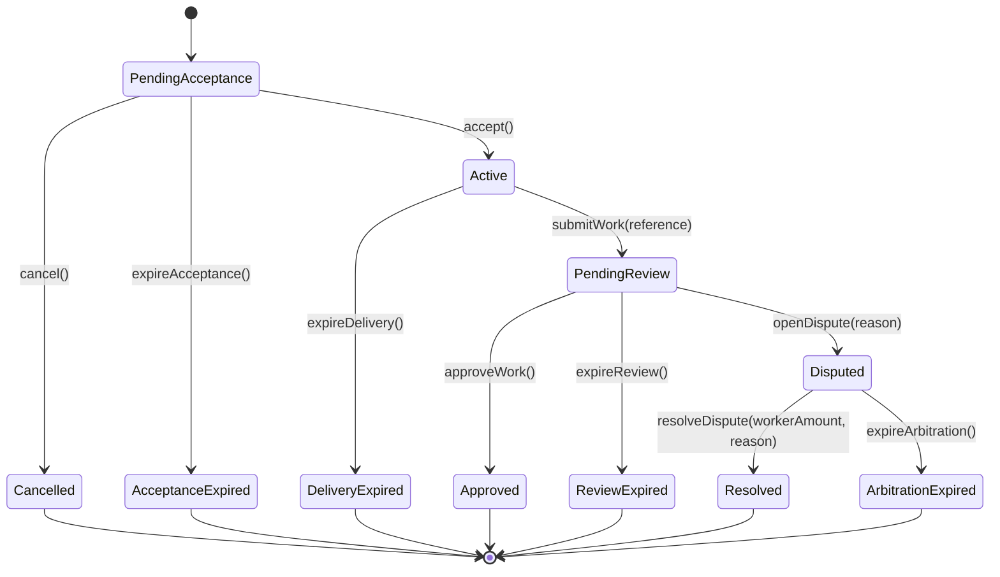

# Guía y resumen de implementación del sistema Escrow

## 1. Objetivo del sistema

El sistema permite crear acuerdos de escrow financiados con ETH para contratar a un `worker`.

Cada acuerdo queda representado por un contrato `Escrow` independiente, creado y registrado mediante `EscrowFactory`.

El contrato debe proteger:

- al `owner`, frente a la falta de aceptación o entrega;
- al `worker`, frente a la falta de aprobación luego de entregar;
- a ambas partes, mediante un arbitraje preacordado;
- a los fondos, separando las transiciones de estado de las transferencias de ETH.

Los fondos nunca se transfieren directamente al finalizar una etapa. Primero se acreditan en `pendingWithdrawals` y luego cada beneficiario ejecuta `withdraw()`.

---

## 2. Arquitectura general

```text
Owner
  |
  | createEscrow{value: amount}(...)
  v
EscrowFactory
  |
  | despliega, financia y registra
  v
Escrow
  ├── owner
  ├── worker
  ├── arbitrator
  ├── fondos del acuerdo
  ├── máquina de estados
  ├── deadlines
  └── saldos pendientes de retiro
```

### Responsabilidad de `EscrowFactory`

La fábrica debe:

- crear contratos `Escrow`;
- transferir el `msg.value` al constructor del nuevo escrow;
- registrar cada dirección creada;
- asociar cada escrow con su `owner`, `worker` y `arbitrator`;
- permitir listar y contar los escrows;
- permitir verificar si una dirección fue creada por la fábrica;
- emitir el evento canónico de creación.

La fábrica no debe:

- mantener fondos de los acuerdos;
- aceptar trabajos;
- registrar entregas;
- aprobar entregas;
- resolver disputas;
- ejecutar retiros.

### Responsabilidad de `Escrow`

Cada escrow debe:

- representar un único acuerdo;
- mantener sus propios fondos;
- validar sus participantes y condiciones;
- controlar las transiciones de estado;
- calcular los deadlines al comenzar cada etapa;
- almacenar las referencias y motivos asociados al acuerdo;
- distribuir contablemente los fondos;
- permitir retiros independientes.

---

## 3. Participantes

Cada escrow tiene tres participantes inmutables:

| Rol          | Responsabilidad                                                                                              |
| ------------ | ------------------------------------------------------------------------------------------------------------ |
| `owner`      | Crea y financia el acuerdo, puede cancelarlo antes de la aceptación, aprobar el trabajo o abrir una disputa. |
| `worker`     | Puede aceptar el acuerdo y registrar la entrega.                                                             |
| `arbitrator` | Puede resolver una disputa antes del vencimiento del arbitraje.                                              |

### Invariantes de participantes

- Ninguna dirección puede ser `address(0)`.
- `owner`, `worker` y `arbitrator` deben ser tres direcciones distintas.
- El `owner` se obtiene de `msg.sender` en `EscrowFactory.createEscrow`.
- El árbitro queda definido durante la creación y no puede modificarse.
- El worker no dispone de una función de rechazo explícito.
- Después de la aceptación no existe cancelación unilateral ni mutua.

---

## 4. Estados

```solidity
enum State {
  PendingAcceptance,
  Active,
  PendingReview,
  Disputed,
  Cancelled,
  AcceptanceExpired,
  DeliveryExpired,
  Approved,
  ReviewExpired,
  Resolved,
  ArbitrationExpired
}
```

### Estados operativos

#### `PendingAcceptance`

Estado inicial.

Significa que:

- el escrow ya fue creado y financiado;
- el worker todavía no aceptó;
- el owner todavía puede cancelar;
- todavía está corriendo `acceptanceDeadline`.

Transiciones posibles:

- `accept()` → `Active`;
- `cancel()` → `Cancelled`;
- `expireAcceptance()` → `AcceptanceExpired`.

#### `Active`

Significa que:

- el worker aceptó;
- el acuerdo está vigente;
- está corriendo `deliveryDeadline`;
- todavía no se registró una entrega.

Transiciones posibles:

- `submitWork(...)` → `PendingReview`;
- `expireDelivery()` → `DeliveryExpired`.

#### `PendingReview`

Significa que:

- el worker registró la entrega;
- `deliveryReference` quedó almacenada;
- el owner debe aprobar o abrir una disputa;
- está corriendo `reviewDeadline`.

Transiciones posibles:

- `approveWork()` → `Approved`;
- `openDispute(...)` → `Disputed`;
- `expireReview()` → `ReviewExpired`.

#### `Disputed`

Significa que:

- el owner abrió una disputa;
- `disputeReason` quedó almacenado;
- el árbitro puede resolver;
- está corriendo `arbitrationDeadline`.

Transiciones posibles:

- `resolveDispute(...)` → `Resolved`;
- `expireArbitration()` → `ArbitrationExpired`.

### Estados terminales

Los siguientes estados son definitivos:

- `Cancelled`
- `AcceptanceExpired`
- `DeliveryExpired`
- `Approved`
- `ReviewExpired`
- `Resolved`
- `ArbitrationExpired`

Desde un estado terminal:

- no puede producirse otra transición;
- no puede reabrirse el acuerdo;
- no puede abrirse otra disputa;
- solo puede ejecutarse `withdraw()` cuando exista saldo pendiente.

No deben existir estados `Paid`, `Withdrawn` ni `PartiallyWithdrawn`. El resultado contractual y los retiros son conceptos separados.

---

## 6. Diagrama Mermaid



---

## 7. Resumen de transiciones

| Estado origen       | Función                                | Quién puede llamarla | Restricción temporal           | Estado destino       | Distribución  |
| ------------------- | -------------------------------------- | -------------------- | ------------------------------ | -------------------- | ------------- |
| `PendingAcceptance` | `accept()`                             | `worker`             | Antes de `acceptanceDeadline`  | `Active`             | Ninguna       |
| `PendingAcceptance` | `cancel()`                             | `owner`              | Antes de `acceptanceDeadline`  | `Cancelled`          | 100% owner    |
| `PendingAcceptance` | `expireAcceptance()`                   | Cualquiera           | Desde `acceptanceDeadline`     | `AcceptanceExpired`  | 100% owner    |
| `Active`            | `submitWork(reference)`                | `worker`             | Antes de `deliveryDeadline`    | `PendingReview`      | Ninguna       |
| `Active`            | `expireDelivery()`                     | Cualquiera           | Desde `deliveryDeadline`       | `DeliveryExpired`    | 100% owner    |
| `PendingReview`     | `approveWork()`                        | `owner`              | Antes de `reviewDeadline`      | `Approved`           | 100% worker   |
| `PendingReview`     | `openDispute(reason)`                  | `owner`              | Antes de `reviewDeadline`      | `Disputed`           | Ninguna       |
| `PendingReview`     | `expireReview()`                       | Cualquiera           | Desde `reviewDeadline`         | `ReviewExpired`      | 100% worker   |
| `Disputed`          | `resolveDispute(workerAmount, reason)` | `arbitrator`         | Antes de `arbitrationDeadline` | `Resolved`           | Según árbitro |
| `Disputed`          | `expireArbitration()`                  | Cualquiera           | Desde `arbitrationDeadline`    | `ArbitrationExpired` | 50/50         |

---

## 8. Reglas temporales

Todas las duraciones se reciben y almacenan en segundos:

- `acceptanceDuration`;
- `workDuration`;
- `reviewDuration`;
- `arbitrationDuration`.

Reglas:

- todas deben ser mayores que cero;
- no tienen un máximo contractual;
- una acción está disponible mientras `block.timestamp < deadline`;
- una expiración está disponible cuando `block.timestamp >= deadline`;
- el instante exacto del deadline ya se considera vencido;
- una acción tardía revierte;
- una acción tardía no materializa automáticamente la expiración;
- cada expiración se procesa mediante una función específica.

### Cálculo de deadlines

- `acceptanceDeadline` se calcula en el constructor.
- `deliveryDeadline` se calcula en `accept()`.
- `reviewDeadline` se calcula en `submitWork()`.
- `arbitrationDeadline` se calcula en `openDispute()`.

Los deadlines de etapas que todavía no comenzaron deben permanecer en `0`.

---

## 9. Interfaz de `EscrowFactory`

### Creación

La interfaz conceptual es:

```solidity
function createEscrow(
  address worker_,
  address arbitrator_,
  uint256 acceptanceDuration_,
  uint256 workDuration_,
  uint256 reviewDuration_,
  uint256 arbitrationDuration_,
  string calldata title_
) external payable returns (address escrowAddress);
```

### Flujo de creación

1. El owner llama a `createEscrow` enviando ETH.
2. La fábrica despliega un nuevo `Escrow`.
3. El constructor recibe `msg.value`.
4. Si alguna validación falla, toda la transacción revierte.
5. La fábrica registra la dirección en todos sus índices.
6. La fábrica marca la dirección en `isEscrow`.
7. La fábrica emite `EscrowCreated`.

### Registros

```solidity
mapping(address owner => address[] escrows) public escrowsByOwner;
mapping(address worker => address[] escrows) public escrowsByWorker;
mapping(address arbitrator => address[] escrows) public escrowsByArbitrator;

address[] public allEscrows;

mapping(address escrow => bool registered) public isEscrow;
```

### Consultas

- `getEscrowCountByOwner(address)`
- `getEscrowCountByWorker(address)`
- `getEscrowCountByArbitrator(address)`
- `getEscrowCount()`

No debe existir un contador global separado. El total es `allEscrows.length`.

### Evento de creación

```solidity
event EscrowCreated(
  address indexed owner,
  address indexed worker,
  address indexed arbitrator,
  address escrowAddress,
  uint256 amount,
  uint256 acceptanceDeadline,
  uint256 workDuration,
  uint256 reviewDuration,
  uint256 arbitrationDuration
);
```

Decisiones:

- `owner`, `worker` y `arbitrator` son `indexed`;
- `escrowAddress` no es `indexed`;
- el título no se emite;
- se emite el deadline absoluto de aceptación;
- las demás etapas emiten sus duraciones porque sus deadlines todavía no existen.

---

## 10. Variables de `Escrow`

### Constantes

```solidity
uint256 public constant MAX_TITLE_LENGTH = 64;
uint256 public constant MAX_DELIVERY_REFERENCE_LENGTH = 256;
uint256 public constant MAX_DISPUTE_REASON_LENGTH = 256;
uint256 public constant MAX_RESOLUTION_REASON_LENGTH = 256;
```

Todas las longitudes se miden en bytes UTF-8 mediante `bytes(value).length`.

### Datos inmutables

```solidity
address public immutable owner;
address public immutable worker;
address public immutable arbitrator;

uint256 public immutable amount;

uint256 public immutable acceptanceDeadline;
uint256 public immutable workDuration;
uint256 public immutable reviewDuration;
uint256 public immutable arbitrationDuration;
```

### Datos de estado

```solidity
State public state;

uint256 public deliveryDeadline;
uint256 public reviewDeadline;
uint256 public arbitrationDeadline;

string public title;
string public deliveryReference;
string public disputeReason;
string public resolutionReason;

mapping(address account => uint256 amount) public pendingWithdrawals;
```

Las referencias y motivos:

- se almacenan;
- no se incluyen en eventos;
- no pueden estar vacíos;
- no pueden modificarse después de su asignación;
- tienen un máximo de 256 bytes.

---

## 11. Funciones de `Escrow`

### `accept()`

Requisitos:

- solo `worker`;
- estado `PendingAcceptance`;
- antes de `acceptanceDeadline`.

Efectos:

- calcula `deliveryDeadline`;
- cambia a `Active`;
- emite `Accepted(deliveryDeadline)`.

### `cancel()`

Requisitos:

- solo `owner`;
- estado `PendingAcceptance`;
- antes de `acceptanceDeadline`.

Efectos:

- acredita el monto completo al owner;
- cambia a `Cancelled`;
- emite `Cancelled()`.

### `expireAcceptance()`

Requisitos:

- estado `PendingAcceptance`;
- desde `acceptanceDeadline`;
- llamable por cualquier cuenta.

Efectos:

- acredita el monto completo al owner;
- cambia a `AcceptanceExpired`;
- emite `AcceptanceExpired()`.

### `submitWork(string deliveryReference_)`

Requisitos:

- solo `worker`;
- estado `Active`;
- antes de `deliveryDeadline`;
- referencia de entre 1 y 256 bytes.

Efectos:

- almacena `deliveryReference`;
- calcula `reviewDeadline`;
- cambia a `PendingReview`;
- emite `WorkSubmitted(reviewDeadline)`.

### `expireDelivery()`

Requisitos:

- estado `Active`;
- desde `deliveryDeadline`;
- llamable por cualquier cuenta.

Efectos:

- acredita el monto completo al owner;
- cambia a `DeliveryExpired`;
- emite `DeliveryExpired()`.

### `approveWork()`

Requisitos:

- solo `owner`;
- estado `PendingReview`;
- antes de `reviewDeadline`.

Efectos:

- acredita el monto completo al worker;
- cambia a `Approved`;
- emite `WorkApproved()`.

### `openDispute(string disputeReason_)`

Requisitos:

- solo `owner`;
- estado `PendingReview`;
- antes de `reviewDeadline`;
- motivo de entre 1 y 256 bytes.

Efectos:

- almacena `disputeReason`;
- calcula `arbitrationDeadline`;
- cambia a `Disputed`;
- emite `DisputeOpened(arbitrationDeadline)`.

### `expireReview()`

Requisitos:

- estado `PendingReview`;
- desde `reviewDeadline`;
- llamable por cualquier cuenta.

Efectos:

- acredita el monto completo al worker;
- cambia a `ReviewExpired`;
- emite `ReviewExpired()`.

### `resolveDispute(uint256 workerAmount, string resolutionReason_)`

Requisitos:

- solo `arbitrator`;
- estado `Disputed`;
- antes de `arbitrationDeadline`;
- `workerAmount <= amount`;
- motivo de entre 1 y 256 bytes.

Efectos:

- calcula `ownerAmount = amount - workerAmount`;
- almacena `resolutionReason`;
- acredita los saldos correspondientes;
- cambia a `Resolved`;
- emite `DisputeResolved(ownerAmount, workerAmount)`.

Los extremos son válidos:

- `workerAmount == 0`;
- `workerAmount == amount`.

### `expireArbitration()`

Requisitos:

- estado `Disputed`;
- desde `arbitrationDeadline`;
- llamable por cualquier cuenta.

Efectos:

```solidity
ownerAmount = amount / 2;
workerAmount = amount - ownerAmount;
```

- acredita ambos saldos;
- el wei sobrante corresponde al worker;
- cambia a `ArbitrationExpired`;
- emite `ArbitrationExpired()`.

### `withdraw()`

Requisitos:

- `pendingWithdrawals[msg.sender] > 0`.

Efectos:

1. obtiene el saldo completo;
2. pone el saldo pendiente en cero;
3. transfiere ETH mediante una llamada externa;
4. revierte si la transferencia falla;
5. emite `FundsWithdrawn(msg.sender, amount)`;
6. no modifica `state`.

---

## 12. Eventos

```solidity
event Accepted(uint256 deliveryDeadline);
event Cancelled();
event AcceptanceExpired();

event WorkSubmitted(uint256 reviewDeadline);
event DeliveryExpired();

event WorkApproved();
event ReviewExpired();

event DisputeOpened(uint256 arbitrationDeadline);

event DisputeResolved(uint256 ownerAmount, uint256 workerAmount);

event ArbitrationExpired();

event FundsWithdrawn(address indexed account, uint256 amount);
```

### Convenciones

- Los eventos no usan el prefijo `Escrow`.
- Describen acciones completadas.
- No repiten al actor cuando puede deducirse por el rol.
- Los deadlines no son `indexed`.
- Los montos de resolución no son `indexed`.
- `FundsWithdrawn.account` sí es `indexed`.
- Los strings se almacenan, pero no se emiten.
- Los repartos deterministas no repiten montos en sus eventos.

---

## 13. Custom errors recomendados

Los nombres exactos pueden ajustarse, pero conviene que cada causa sea distinguible.

### Estado y permisos

```solidity
error InvalidState(State currentState, State expectedState);
error OnlyOwnerAllowed();
error OnlyWorkerAllowed();
error OnlyArbitratorAllowed();
```

### Tiempo

```solidity
error OnlyAllowedBeforeTime(uint256 allowedBeforeTime);
error OnlyAllowedAfterTime(uint256 allowedAfterTime);
```

`OnlyAllowedAfterTime` debe entenderse como permitido cuando:

```text
block.timestamp >= allowedAfterTime
```

### Creación y participantes

```solidity
error NoEthProvided();
error ZeroAddress();
error CannotHireYourself();
error ParticipantsMustBeDifferent();
error ZeroDuration();
```

Puede mantenerse `CannotHireYourself` para `owner == worker` y usar otro error para los conflictos con el árbitro, o reemplazarse por un único error general de participantes duplicados.

### Strings

```solidity
error EmptyTitle();
error TitleTooLong(uint256 currentLength, uint256 maxLength);

error EmptyDeliveryReference();
error DeliveryReferenceTooLong(uint256 currentLength, uint256 maxLength);

error EmptyDisputeReason();
error DisputeReasonTooLong(uint256 currentLength, uint256 maxLength);

error EmptyResolutionReason();
error ResolutionReasonTooLong(uint256 currentLength, uint256 maxLength);
```

### Resolución y retiros

```solidity
error WorkerAmountExceedsEscrow(uint256 workerAmount, uint256 escrowAmount);

error NoFundsToWithdraw();
error WithdrawalFailed();
```

### Recomendación de consistencia

Para facilitar los tests:

- usar errores específicos para strings distintos;
- incluir longitud actual y máxima en errores de límite;
- incluir valor provisto y máximo en errores numéricos;
- no reemplazar errores claros por un único `InvalidArgument()` genérico.

---

## 14. Withdrawal pattern

Las transiciones terminales no deben enviar ETH.

En su lugar:

```text
Transición terminal
        |
        v
pendingWithdrawals[beneficiary] += amount
        |
        v
beneficiary llama withdraw()
        |
        v
transferencia de ETH
```

### Motivos

- evita que un receptor que rechaza ETH bloquee la transición;
- owner y worker pueden retirar de manera independiente;
- simplifica las resoluciones proporcionales;
- separa el resultado contractual de la transferencia;
- reduce el riesgo de reentrancia cuando se aplica checks-effects-interactions.

### Checks-effects-interactions

El orden de `withdraw()` debe ser:

```text
Check:
- verificar saldo pendiente

Effects:
- poner el saldo en cero

Interaction:
- transferir ETH
```

Si la transferencia revierte, Solidity restaura automáticamente el saldo anterior.

### Reentrancia

El patrón anterior evita el retiro repetido porque el saldo se borra antes de la llamada externa.

Como defensa adicional puede utilizarse `nonReentrant`, aunque la corrección principal no debe depender únicamente del modificador.

---

## 15. Invariantes contables

Estas condiciones deben cumplirse siempre:

1. El contrato recibe exactamente `amount` durante la creación.
2. Ninguna transición operativa distribuye fondos.
3. Cada escrow alcanza como máximo una transición terminal.
4. Cada transición terminal distribuye exactamente `amount`.
5. La suma de las asignaciones al owner y worker es siempre `amount`.
6. Ningún beneficiario recibe más que su saldo pendiente.
7. Un retiro exitoso reduce el saldo pendiente del llamante a cero.
8. Un retiro fallido no destruye el saldo pendiente.
9. `withdraw()` no modifica el resultado contractual.
10. El saldo del contrato debe ser igual a la suma de retiros pendientes todavía no cobrados.

La última propiedad puede expresarse conceptualmente como:

```text
address(this).balance
==
pendingWithdrawals[owner] + pendingWithdrawals[worker]
```

después de una finalización y antes de transferencias externas inesperadas.

Debe tenerse presente que ETH puede ser forzado hacia un contrato mediante mecanismos externos. Por eso, no conviene usar igualdad exacta del balance como una condición interna crítica del protocolo. Sí puede utilizarse para tests dentro de escenarios controlados.

---

## 16. Orden recomendado de actualización de estado

Para las funciones sin llamadas externas:

1. validar permisos;
2. validar estado;
3. validar deadline;
4. validar parámetros;
5. almacenar datos;
6. calcular deadlines o distribuciones;
7. acreditar saldos;
8. actualizar `state`;
9. emitir el evento.

No existe una única obligación entre actualizar el estado y acreditar saldos porque toda la transacción es atómica y no hay interacción externa. Sin embargo, conviene usar un orden uniforme en todas las funciones.

Para `withdraw()`:

1. leer el saldo;
2. validar que no sea cero;
3. borrar el saldo;
4. realizar la llamada externa;
5. emitir el evento.

---

## 17. Validaciones del constructor

El constructor de `Escrow` debe validar:

- `msg.value > 0`;
- `owner != address(0)`;
- `worker != address(0)`;
- `arbitrator != address(0)`;
- los tres participantes son distintos;
- las cuatro duraciones son mayores que cero;
- el título no está vacío;
- el título tiene como máximo 64 bytes.

Debe inicializar:

```text
owner
worker
arbitrator
amount
acceptanceDeadline
workDuration
reviewDuration
arbitrationDuration
title
state = PendingAcceptance
```

Aunque la fábrica sea el único flujo previsto de despliegue, mantener estas validaciones en `Escrow` protege las invariantes del contrato.

---

## 18. Atomicidad de la fábrica

La creación debe ser atómica:

```text
despliegue
+ transferencia de ETH
+ registros
+ evento
```

Si cualquier paso revierte:

- el contrato no debe quedar desplegado de forma útil;
- no deben agregarse direcciones a los arrays;
- `isEscrow` no debe modificarse;
- la fábrica no debe retener ETH;
- los registros existentes deben permanecer exactamente iguales.

El constructor realiza las validaciones antes de que la fábrica actualice sus registros, por lo que una creación inválida revierte antes de los `push`.

---

## 19. Tests no obvios o especialmente importantes

No se enumeran aquí los tests básicos de permisos, estados, eventos y valores iniciales. Además de esos casos evidentes, conviene cubrir los siguientes.

### 19.1 Límites temporales exactos

Para cada etapa, probar:

- un segundo antes del deadline;
- exactamente en el deadline;
- después del deadline.

En el instante exacto:

- la acción normal debe revertir;
- la expiración debe estar permitida.

### 19.2 Carrera lógica después del vencimiento

Probar que, aunque el estado todavía no se haya actualizado:

- `accept()` no puede ganar contra `expireAcceptance()` después del deadline;
- `submitWork()` no puede ganar contra `expireDelivery()`;
- `approveWork()` y `openDispute()` no pueden ganar contra `expireReview()`;
- `resolveDispute()` no puede ganar contra `expireArbitration()`.

### 19.3 Estado previo no vacío ante creación inválida

Antes de una creación inválida:

- crear uno o más escrows válidos;
- guardar todas las listas, counts, direcciones y balances;
- intentar crear un escrow inválido;
- verificar que todos los registros existentes permanecen iguales.

Esto evita un test débil que solo compruebe que arrays inicialmente vacíos continúan vacíos.

### 19.4 Distribución arbitral extrema

Probar:

- `workerAmount == 0`;
- `workerAmount == amount`;
- `workerAmount` intermedio;
- `workerAmount == amount + 1`.

### 19.5 División 50/50 impar

Probar un monto impar en wei:

```text
amount = 5 wei
owner = 2 wei
worker = 3 wei
```

También probar un monto par.

### 19.6 Retiros independientes

Después de una distribución proporcional:

- el owner retira;
- el estado permanece `Resolved`;
- el saldo del worker continúa intacto;
- el worker retira después;
- no existe dependencia entre ambos.

### 19.7 Receptor que rechaza ETH

Usar un contrato receptor que haga revert en `receive()`:

- asignarle fondos;
- llamar a `withdraw()`;
- verificar el revert;
- verificar que el saldo pendiente fue restaurado;
- verificar que otro beneficiario todavía puede retirar.

### 19.8 Referencias UTF-8

Probar límites por bytes, no por cantidad visual de caracteres:

- texto ASCII de exactamente 256 bytes;
- texto Unicode cuya representación exceda 256 bytes;
- cadena visualmente corta con emojis que supere el límite.

### 19.9 Deadlines todavía no iniciados

Comprobar que:

- `deliveryDeadline == 0` antes de aceptar;
- `reviewDeadline == 0` antes de entregar;
- `arbitrationDeadline == 0` antes de abrir disputa.

### 19.10 Inmutabilidad lógica de strings

Comprobar que no existe ninguna función que permita:

- reemplazar `deliveryReference`;
- cambiar `disputeReason`;
- modificar `resolutionReason`.

### 19.11 Registros por roles coincidentes entre escrows

Una misma cuenta puede actuar como:

- owner en un escrow;
- worker en otro;
- arbitrator en otro.

Probar que cada creación se registra únicamente en el mapping correspondiente a su rol dentro de ese acuerdo.

---

## 20. Consideraciones para la interfaz web

La UI debe determinar las acciones disponibles combinando:

- `state`;
- cuenta conectada;
- rol de la cuenta;
- timestamp actual;
- deadline correspondiente;
- saldo en `pendingWithdrawals`.

### Ejemplos

En `PendingAcceptance`:

- owner antes del deadline: mostrar `Cancelar`;
- worker antes del deadline: mostrar `Aceptar`;
- cualquier cuenta desde el deadline: permitir `Procesar vencimiento`.

En `PendingReview`:

- owner antes del deadline: mostrar `Aprobar` y `Abrir disputa`;
- cualquier cuenta desde el deadline: permitir `Procesar vencimiento de revisión`.

En `Disputed`:

- árbitro antes del deadline: mostrar formulario de resolución;
- cualquier cuenta desde el deadline: permitir `Aplicar distribución 50/50`.

En cualquier estado:

- si `pendingWithdrawals[account] > 0`, mostrar `Retirar fondos`.

La UI debe consultar directamente:

- `title`;
- `deliveryReference`;
- `disputeReason`;
- `resolutionReason`.

Estos valores no están incluidos en eventos.

---

## 21. Orden sugerido de implementación

1. Actualizar el enum y las variables de `Escrow`.
2. Agregar validaciones del constructor.
3. Implementar `accept()` y el cálculo de `deliveryDeadline`.
4. Implementar cancelación y expiración de aceptación.
5. Implementar entrega y expiración de entrega.
6. Implementar aprobación y expiración de revisión.
7. Implementar apertura y resolución de disputas.
8. Implementar expiración arbitral 50/50.
9. Implementar `pendingWithdrawals` y `withdraw()`.
10. Definir y emitir todos los eventos.
11. Actualizar la interfaz de creación de la fábrica.
12. Agregar registro por árbitro e `isEscrow`.
13. Adaptar helpers y fixtures.
14. Implementar tests por transición.
15. Implementar los casos temporales, contables y de atomicidad menos obvios.
16. Integrar la UI usando la ABI final.

---

## 22. Resumen ejecutivo

El flujo principal es:

```text
PendingAcceptance
    → Active
    → PendingReview
    → Approved
```

Si el owner no responde:

```text
PendingReview
    → ReviewExpired
```

Si existe desacuerdo:

```text
PendingReview
    → Disputed
    → Resolved
```

Si el árbitro no responde:

```text
Disputed
    → ArbitrationExpired
```

Si el acuerdo no avanza:

```text
PendingAcceptance
    → Cancelled o AcceptanceExpired

Active
    → DeliveryExpired
```

Los fondos se asignan al llegar a un estado terminal y se transfieren únicamente mediante:

```text
withdraw()
```

El diseño separa claramente:

- estado contractual;
- evidencia y motivos;
- condiciones temporales;
- asignación contable;
- transferencia efectiva de ETH;
- descubrimiento e indexación mediante la fábrica.
