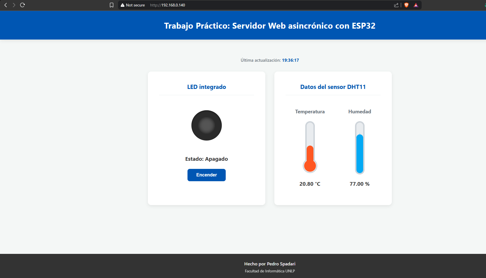

# Trabajo Práctico: Servidor Web asincrónico con ESP32 - Spadari Pedro - Facultad de Informática UNLP - Cátedra IoT

## Captura de pantalla

## Opcionales implementados
### Almacenado de archivos estáticos usando LittleFS
Se usó LittleFS en lugar de SPIFFS porque no encontraba una librería que funcione en la versión de ArduinoIDE 2.3.8 con SPIFFS, entonces usé la librería [https://github.com/earlephilhower/arduino-littlefs-upload](https://github.com/earlephilhower/arduino-littlefs-upload) para poder subir los archivos a la ESP32

### Configuración de WiFi usando WiFiManager
El único problema que tuve es que al configurar una nueva red WiFi y luego iniciar el `AsyncWebServer`, no se podía conectarse a la página a menos que se resetee, entonces definí un callback usando una función de la librería `setSaveConfigCallback` para que, al guardarse una nueva configuración de WiFi, se resetee la ESP32 y así sí me funcionó (aunque la primera vez tarda un poco más porque se resetea la placa)

Notas:
1. El SSID del AP levantado por la librería `WiFiManager` está definido en `config.h`, en la constante `wifiManagerAPSSID` que por default es `ESP32-AP-TP-PedroS`

2. La IP del AP levantado por la librería `WiFiManager` por default es la `192.168.4.1`, por lo que esa es la dirección que se debe ingresar en el navegador, luego de conectarse al AP, para configurar el WiFi

### Actualización automática de valores con Axios
Se usó Axios para realizar las requests a la API sin necesidad de regrescar la página

Por default los datos se actualizan cada 1s, esto está definido en `app.js` en la constante `TIEMPO_ACTUALIZACION_MS`

### El diseño es responsive para celular
La página se puede usar sin problemas desde el celular y se ve adecuadamente

La configuración de WiFi con `WiFiManager` también se puede hacer desde el celular sin problemas