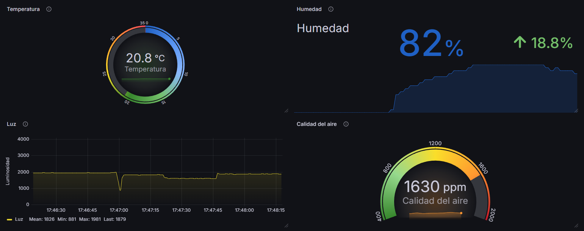
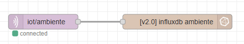

# Trabajo Práctico: Estación de Monitoreo Ambiental - Spadari Pedro - Facultad de Informática UNLP - Cátedra IoT

## Capturas de pantalla

## ESP32
### Sensores

Los sensores usados son:

- DHT11 para temperatura y humedad
- ldr para luz
- Simulación de valores de mq135 para calidad de aire

#### LDR

En Grafana, los valores del LDR se muestran en las unidades leídas directamente del sensor por el ADC, es decir, en el rango de 0..4095 (12 bits)

### Notas WiFiManager:

1. El SSID del AP levantado por la librería `WiFiManager` está definido en `config.hpp`, en la constante `wifiManagerAPSSID` que por default es `ESP32-AP-TP-PedroS`

2. La IP del AP levantado por la librería `WiFiManager` por default es la `192.168.4.1`, por lo que esa es la dirección que se debe ingresar en el navegador, luego de conectarse al AP, para configurar el WiFi

## nodered

# HACER INFORME
# ESCRIBIR QUÉ PASOS HAY Q SEGUIR PARA INICIALIZAR NODERED: INSTALAR EL PLUGIN O COMOSEA DE INFLUXDB, IMPORTAR EL FLUJO nodered-flow.json Y SETEAR COMO TOKEN EL QUE ESTÁ EN .env
# VER SI FUNCIONA LO DE INICIALIZAR GRAFANA Y NODERED DE 0 PARA HACERLO CAMBIAR NOMBRE DEL NAMED VOLUME, DOCKER COMPOSE DOWN (SIN -V) Y UP, PARA TENER EL VOLUME ORIGINAL POR LAS DUDAS QUE NO ANDE ALGO Y NO PERDER LA INFO. LO MISMO CON INFLUX, PORQUE SINO EL TOKEN DE .ENV NO VA A SER VALIDO
